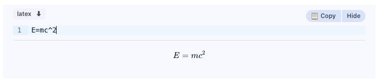
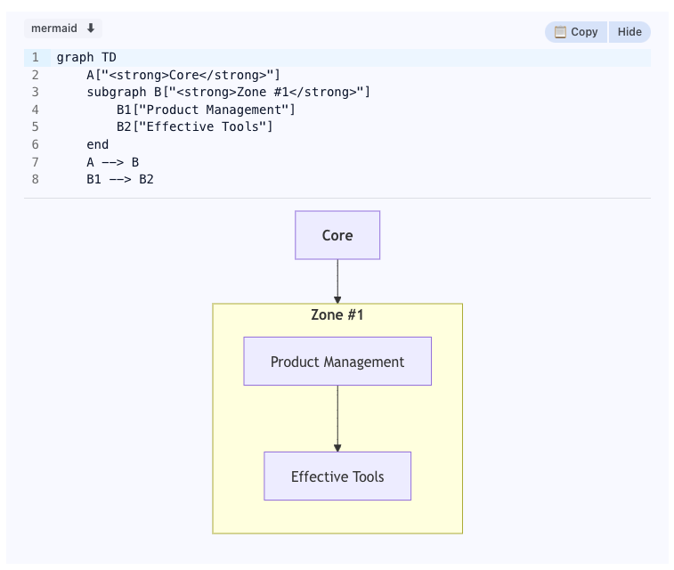

# milkdown-render-mermaid

## Preview





## Usage

> `milkdown-editor.tsx`

```tsx
import { Editor } from 'milkdown'
import { useState } from 'react'
import { Modal } from '@mantine/core'

export const Milk = () => {
  const [previewMermaid, setPreviewMermaid] = useState(null)

  const editor = Editor.make().config(ctx => {
    ctx.update(codeBlockConfig.key, (defaultConfig) => ({
      ...defaultConfig,
      languages,
      extensions: [customExtension, EditorView.lineWrapping],
      searchPlaceholder: t('misc.search'),
      noResultText: t('placeholder.no-result'),
      onCopy: () => {
        message.success(t('message.copy-successfully'))
      },
      renderPreview: (language, content) => {
        if (
          // we believe that latex and math are the same.
          (language.toLowerCase() === 'latex' || language.toLowerCase() === 'math') &&
          content.length > 0
        ) {
          return renderLatex(content, {})
        }
        if (language.toLowerCase() === 'mermaid' && content.length > 0) {
          const handleClick = (e: any) => {
            // this is used to open mermaid preview modal.
            setPreviewMermaid(e)
          }
          return renderMermaid(content, handleClick)
        }
        const renderPreview = defaultConfig.renderPreview
        return renderPreview(language, content)
      }
    }))
  })

  return (
    <div>
      <MilkdownEditor />
      <Modal
        title="Mermaid Preview"
        opened={!!previewMermaid}
        onClose={() => setPreviewMermaid(null)}
        centered
        size={'80vw'}
      >
        <div
          className="w-full h-[70vh] flex items-center justify-center border-solid border-slate-200 border-[1px] bg-[conic-gradient(#f1f2f5_25%,_transparent_0_50%,_#f1f2f5_0_75%,_transparent_0)]
  -bg-[length:32px_32px]"
        >
          <ZoomPanPinchPane>
            {previewMermaid && (
              <div
                dangerouslySetInnerHTML={{ __html: previewMermaid }}
                className="w-full h-full flex items-center justify-center"
              />
            )}
          </ZoomPanPinchPane>
        </div>
      </Modal>
    </div>
  )
}
```

> `render-mermaid.tsx`

```tsx
import mermaid from 'mermaid'
import { v4 as uuidv4 } from 'uuid'

export const renderMermaid = (content: string, handleClick?: any) => {
  const uniqueId = `unique-${uuidv4()}`
  const id = `mermaid-${uniqueId}`
  const el = document.createElement('div')
  el.textContent = ''
  el.id = id

  mermaid
    .render(uniqueId, content)
    .then((item) => {
      const svg = document.createElement('div')
      svg.innerHTML = item.svg
      document.getElementById(id)?.appendChild(svg)
      // click svg to open mermaid preview modal.
      svg.addEventListener('click', () => handleClick(item.svg))
    })
    .catch((r) => {
      const childEl = document.createElement('div')
      childEl.textContent = r
      document.getElementById(id)?.appendChild(childEl)
    })

  return el
}
```

> `render-latex.tsx`

```tsx
import type { KatexOptions } from 'katex'
import katex from 'katex'

export const renderLatex = (content: string, options?: KatexOptions) => {
  const html = katex.renderToString(content, {
    ...options,
    throwOnError: false,
    displayMode: true
  })
  return html
}

```
