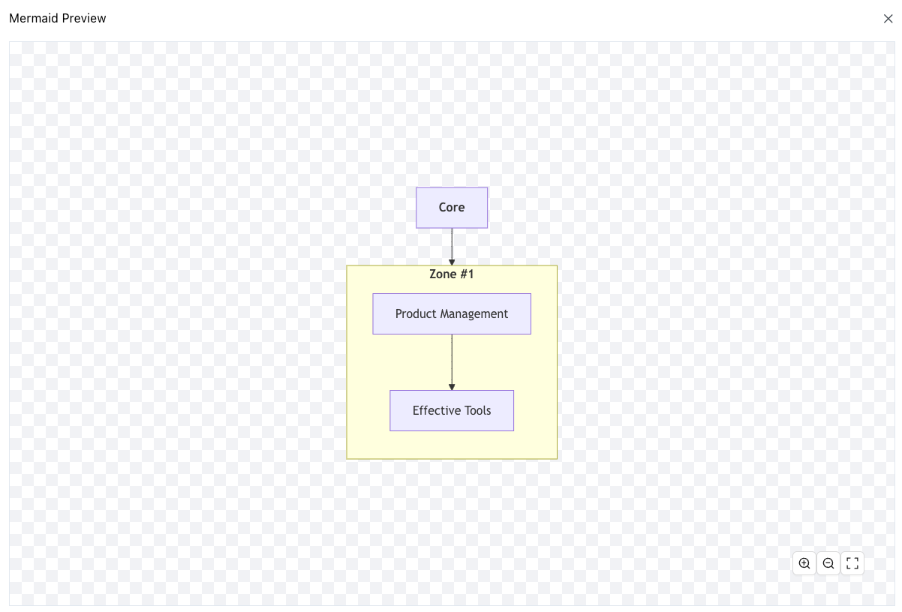

# react-zoom-pan-pinch

Use react-zoom-pan-pinch to create a zoomable, pannable, and pinchable pane.

## Preview

> You can drag and zoom in and out of the pane.



## Usage

```tsx
import { ExpandOutlined, ZoomInOutlined, ZoomOutOutlined } from '@ant-design/icons';
import { Button } from 'antd';
import { FC } from 'react';
import { TransformComponent, TransformWrapper, useControls } from 'react-zoom-pan-pinch';

export const ZoomPanPinchPane: FC<{ children: React.ReactNode }> = ({ children }) => {
  const Controls = () => {
    const { zoomIn, zoomOut, resetTransform } = useControls();
    return (
      <div className='absolute bottom-10 right-10 z-20'>
        <Button icon={<ZoomInOutlined />} onClick={() => zoomIn()} />
        <Button icon={<ZoomOutOutlined />} onClick={() => zoomOut()} />
        <Button icon={<ExpandOutlined />} onClick={() => resetTransform()} />
      </div>
    );
  };

  return (
    <TransformWrapper>
      <div className='relative w-full h-full flex items-center justify-center'>
        <TransformComponent wrapperClass='!w-full !h-full' contentClass='!w-full !h-full'>
          {children}
        </TransformComponent>
        <Controls />
      </div>
    </TransformWrapper>
  );
};
```
